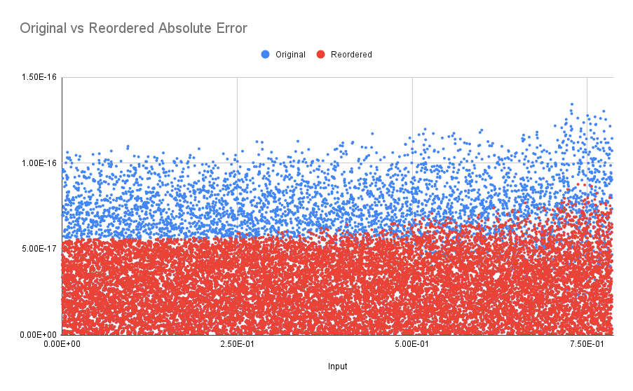

# VDT Cos bug

On line 123 of `sincos.h` in VDT we see

    c = 1.0 - zz * .5 + zz * zz * get_cos_px(zz);

Error can be decreased by evaluating the expression as

    c = 1.0 + zz * (-.5 + zz * get_cos_px(zz));

This is the only change present between the two include directories.

Graphing the error of the two versions on the domain $[0, \frac{\pi}{4}]$ we get

